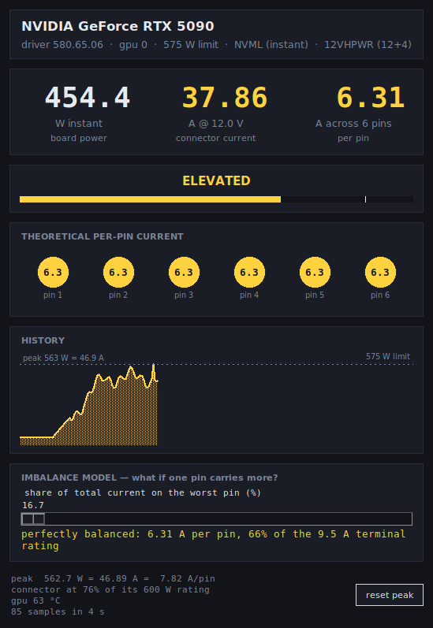

# pinwatch

A small live monitor for how hard you are working the 12VHPWR connector on an
NVIDIA card under Linux. It reads board power from the driver, converts it to
connector current, and shows what that works out to per pin.

Zero dependencies — stdlib Python plus Tk. It talks to `libnvidia-ml.so.1`
directly through `ctypes`, so there is no `pynvml` to install and no
`nvidia-smi` process spawned per sample.



<sub>Screenshot rendered against a synthetic load curve, not a physical card.</sub>

## Read this before you trust the numbers

**The per-pin figure is arithmetic, not a measurement.** Nothing in the driver
reports per-pin current, and no consumer 50-series card has per-pin sense
hardware. pinwatch divides total current by the number of pins. That is the
*ideal balanced* case — and connector failures happen precisely when the load
is *not* balanced. A card that reads a comfortable 6.9 A/pin here can still
have one terminal carrying 20 A.

The imbalance slider exists to make that concrete: drag it to see what a given
share on one pin would mean. It models a scenario; it does not detect one.
Actually measuring imbalance takes a shunt on each conductor or a clamp meter.

**Board power is not connector power.** The driver reports whole-board draw,
which includes up to 75 W from the PCIe slot. pinwatch attributes all of it to
the connector by default, which is the conservative direction. If you know your
card's slot draw, pass `--slot-watts` to subtract it.

**Voltage is assumed, not read.** The conversion uses 12.0 V nominal. Under
load a real rail sags to ~11.4–11.8 V, which means real current is a few
percent *higher* than shown. Use `--volts` if you have measured yours.

## Install

Needs Python 3.10+, the proprietary NVIDIA driver, and Tk:

```sh
sudo apt install python3-tk      # Debian/Ubuntu
sudo dnf install python3-tkinter # Fedora
sudo pacman -S tk                # Arch
```

Then either run it in place:

```sh
python3 -m pinwatch
```

or install it so `pinwatch` lands on your PATH:

```sh
pipx install .    # or: pip install --user .
```

No root needed — NVML power queries work as an unprivileged user.

## Usage

```
pinwatch                       # GUI, GPU 0, 12VHPWR, 4 samples/sec
pinwatch --console             # text mode, for SSH
pinwatch --once                # one reading, for scripts
pinwatch -i 0.1                # poll at 10 Hz to catch transients
pinwatch -s 50                 # attribute 50 W to the PCIe slot
pinwatch -v 11.6               # use a measured rail voltage
pinwatch --share 30            # model 30% of total current on one pin
pinwatch -c pcie8              # model an 8-pin instead
pinwatch -g 1                  # second GPU
```

`--help` lists the rest. In the GUI, `r` resets the peak and `Esc` quits.

## What the colours mean

Thresholds come from the connector spec rather than being hardcoded, so
switching connectors rescales them correctly. For 12VHPWR:

| Band | Per-pin current | Meaning |
|---|---|---|
| nominal | < 5.0 A | under 60% of spec-max load |
| elevated | 5.0 – 8.33 A | normal territory up to the connector's rated 600 W |
| high | 8.33 – 9.5 A | past spec-max load, still inside the terminal rating |
| critical | > 9.5 A | past what a single terminal is rated to carry |

The two anchors: 600 W / 12 V = 50 A across 6 pins = **8.33 A per pin** at the
connector's rating, and the Micro-Fit+ terminals are rated **9.5 A** each.
That is a design margin of 1.14x — which is the whole reason this connector is
worth watching. A PCIe 8-pin, for comparison, runs about 1.9x.

A 5090 at its stock 575 W limit sits in *elevated*, near the top. That is
expected and is not a fault; it is just how little headroom the standard leaves.

## Layout

```
pinwatch/
  nvml.py      ctypes binding to libnvidia-ml, nvidia-smi fallback
  power.py     connector specs and the watts -> amps -> per-pin math
  sampler.py   background polling thread
  gui.py       Tk window
  cli.py       arg parsing, console front-end
tests/         unit tests for the math
```

Run the tests with `python3 -m unittest discover -s tests`.

## Desktop launcher

```sh
install -Dm644 packaging/pinwatch.desktop ~/.local/share/applications/pinwatch.desktop
```
